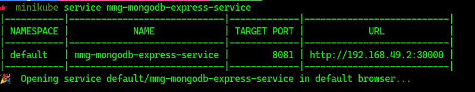

# EMLO_S5


## Commands

```
minikube start
kubectl get nodes
kubectl version
minikube status
kubectl get pods

kubectl create -h
kubectl create deployment mmg-nginx-depl --image=nginx

kubectl get pods
kubectl get deployments
kubectl get replicaset
kubectl edit deployment # change image nginx-> nginx:1.16 & replicas to 2
kubectl get pods

kubectl create deployment mmg-mongo-depl --image=mongo
kubectl get pods
kubectl get replicaset

kubectl logs mmg-nginx-depl-66c57c87fd-ljlfc
kubectl describe pod mmg-nginx-depl-66c57c87fd-ljlfc

kubectl exec -it mmg-nginx-depl-66c57c87fd-ljlfc -- /bin/bash

kubectl get all

kubectl delete deployment mmg-mongo-depl
kubectl delete deployment mmg-nginx-depl

kubectl get all


gedit mmg-nginx-deployment.yaml

kubectl apply -f  mmg-nginx-deployment.yaml

kubectl get pods
kubectl get deployments


kubectl get all | grep nginx

kubectl apply -f  mmg-nginx-service.yaml
kubectl get service
kubectl describe service mmg-nginx-service
kubectl get pods -o wide

kubectl get deployment mmg-nginx-deployment -o yaml > mmg-nginx-deployment-result.yaml


kubectl delete deployment mmg-nginx-deployment
kubectl delete service mmg-nginx-service
kubectl get replicaset

gedit mmg-mongo-deployment.yaml
gedit mmg-mongo-secret.yaml

kubectl apply -f mmg-mongo-secret.yaml
kubectl apply -f mmg-mongo-deployment.yaml

kubectl get deployments
kubectl get pods -o wide
kubectl get service

kubectl describe service mmg-mongodb-service

gedit mmg-mongo-express.yaml
gedit mmg-mongo-configmap.yaml

kubectl apply -f mmg-mongo-configmap.yaml
kubectl apply -f mmg-mongo-express.yaml

kubectl get pods
minikube service mmg-mongodb-express-service

```

## Result

